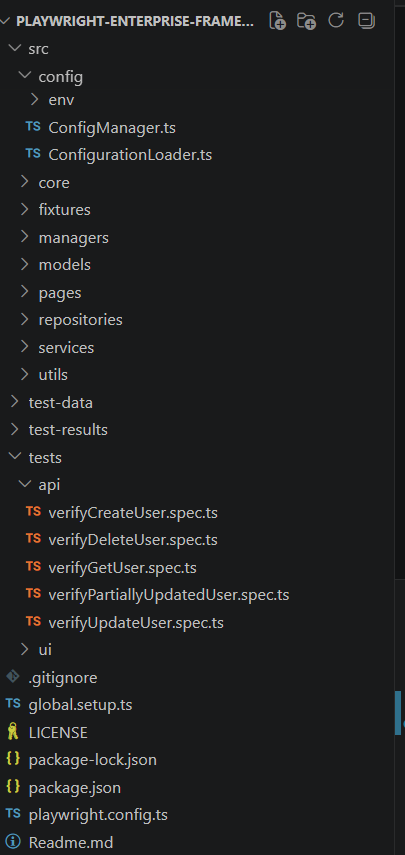
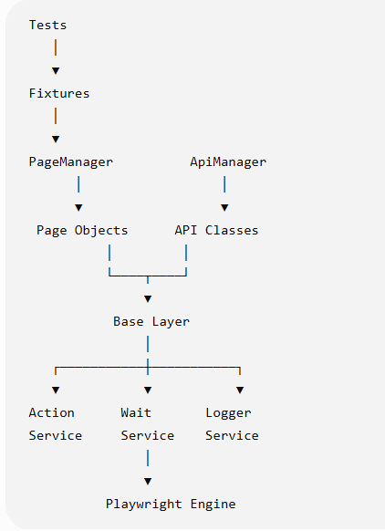
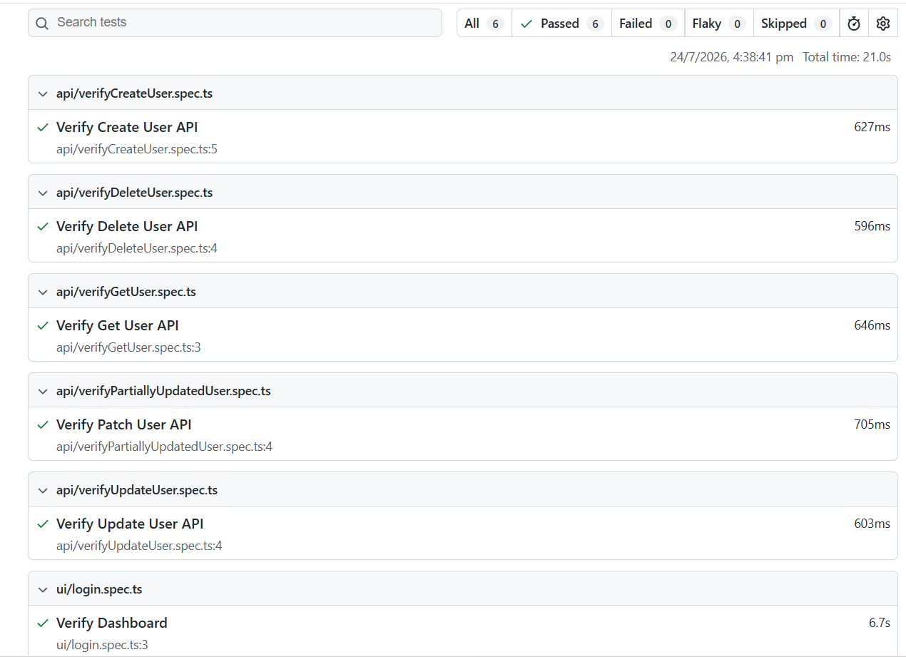

# Playwright Enterprise Framework

An enterprise-grade UI and API automation framework built using Playwright and TypeScript. The framework follows industry-standard design principles, emphasizing scalability, maintainability, and reusable components.


## Overview

This project is an enterprise-grade UI and API automation framework built using Playwright and TypeScript. It follows scalable design principles such as the Page Object Model, reusable services, centralized configuration management, and a generic API client to support maintainable and extensible test automation.

## Project Goals

- Build a scalable enterprise automation framework.
- Demonstrate clean architecture and SOLID design principles.
- Support both UI and API automation within a single framework.
- Showcase industry best practices for Playwright and TypeScript.

## Features

### UI Automation
- ✅ Page Object Model (POM)
- ✅ Page Manager
- ✅ Reusable Base Page
- ✅ Custom Fixtures

### API Automation
- ✅ Generic API Client
- ✅ API Manager
- ✅ CRUD Operations
- ✅ Typed Request & Response Models

### Framework
- ✅ Configuration Management
- ✅ Global Setup
- ✅ Authentication
- ✅ Logging
- ✅ HTML Reports

## Tech Stack
| Technology     | Purpose              |
| -------------- | -------------------- |
| Playwright     | UI Automation        |
| TypeScript     | Programming Language |
| Node.js        | Runtime              |
| GitHub Actions | CI/CD                |
| REST API       | API Testing          |

## Project Structure



## Framework Architecture

The framework follows a layered architecture to keep UI automation, API automation, reusable services, and test logic cleanly separated.



## Prerequisites

- Node.js 20+
- npm
- Playwright browsers


## Installation

```bash
git clone https://github.com/kstvds24/playwright-enterprise-framework.git

cd playwright-enterprise-framework

npm install

npx playwright install
```

## Running Tests

Run all tests:

```bash
npx playwright test
```

Run API tests:

```bash
npx playwright test tests/api
```

Run UI tests:

```bash
npx playwright test tests/ui
```
## Test Report

The framework generates a detailed HTML report after every execution.



## 📊 Test Report

View the latest automated test execution:

👉 [Live Allure Report](https://kstvds24.github.io/playwright-enterprise-framework/)

## Roadmap

- [ ] Authentication Manager
- [ ] API Schema Validation
- [ ] Docker Support
- [ ] Allure Reporting
- [ ] GitHub Actions CI/CD
- [ ] Cross-browser Execution Matrix
- [ ] Test Data Builder Pattern

## Author

Kaustav Das

Senior SDET

GitHub: [Kaustav](https://github.com/kstvds24/)

## License

This project is licensed under the MIT License.

---

⭐ If you find this project useful, consider giving it a star on GitHub.


